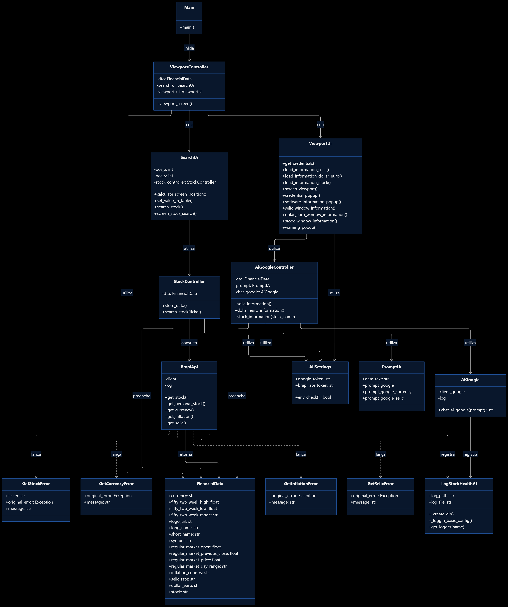

# StockHealth AI — Intelligent Stock Analysis Desktop

```bash
VERSÃO = 1.0.0
```

## 📖 Sobre o Projeto

StockHealth AI é um aplicativo desktop desenvolvido em Python que auxilia usuários na análise de ações do mercado 
financeiro.
O sistema coleta dados de APIs financeiras trazendo resultados da ação pesquisada e utiliza Inteligência Artificial 
para avaliar a saúde financeira de uma ação, ajudando na tomada de decisão de investimento.
O objetivo principal é fornecer uma ferramenta simples e acessível para iniciantes e pequenas empresas realizarem 
análises básicas e avançadas do mercado.

🎯 Objetivo

- Consultar dados do mercado financeiro via API
- Exibir informações de ações de forma simples ou detalhada
- Realizar análise automatizada com IA
- Avaliar a saúde financeira de ativos
- Auxiliar na tomada de decisão de investimentos
- Fornecer interface desktop intuitiva

👥 Público-Alvo

- Iniciantes que desejam aprender sobre investimentos
- Microempresas que precisam de análise rápida de mercado
- Estudantes de tecnologia e finanças
- Usuários interessados em apoio à decisão financeira

---

## Pré requisitos para rodar em sua maquina.

- Tenha instalado **windows 10 ou superior**.
- Tenha em mãos sua chave da api **Brapi** e do google **gemini**.
- Com as chaves das api em mãos insira no próprio software ou crie variaveis de ambiente com o seguinte nomes
**GOOGLE_GEMINI**, **BRAPI_API_TOKEN** (COM VARIAVEIS DE AMBIENTE FACILITA MELHOR O USO DO SOFTWARE).

---

## Inicie o software

> git clone https://github.com/matheusmendes58/stockhealthai.git

> cd stockhealthai

> python -m venv venv

> cd venv/Scripts
 
> activate

> cd api_analise_financeira_automatizada

> pip install -r requirements.txt

> python main.py

---

## Modelos de IA Utilizados

Foi utilizado modelo do gemini versão gratuita **gemini-2.5-flash** então em alguns casos a própria IA traz respostas
em ingles ou genéricas por falta de informações ou talvez por ser um modelo gratuito.
**observação - Como este software ainda é uma versão inicial ajustes serão realizados no prompt e em código conforme a
demanda necessaria.**

---

## Regras de negocio

Realizar busca na api brapi e trazer informações necessarias de acão pesquisada e com ajuda da ia trazer uma panorama
geral da ação por exemplo se ela está saudavel e confiavel para investir.
Ter uma interface grafica para auxiliar o úsuario na busca de ações financeiras.

---

## Database

>ESTE SOFTAWARE NÃO CONTÉM BANCO DE DADOS PRÓPRIO.

---

## UML



---

## Arquitetura visual em texto simples

                    ┌──────────────────┐
                    │      main.py     │
                    └────────┬─────────┘
                             │
                             ▼
              ┌──────────────────────────┐
              │   ViewportController     │
              └────────────┬─────────────┘
                           │
              ┌────────────┴────────────┐
              ▼                         ▼
     ┌────────────────┐       ┌─────────────────┐
     │   SearchUi     │       │   ViewportUi    │
     └───────┬────────┘       └────────┬────────┘
             │                         │
             ▼                         ▼
     ┌────────────────┐       ┌─────────────────┐
     │ StockController│       │AiGoogleController│
     └───────┬────────┘       └────────┬────────┘
             │                         │
             ▼                         ├──────────────┐
     ┌────────────────┐                │              │
     │    BrapiApi    │                ▼              ▼
     └───────┬────────┘        ┌────────────┐  ┌────────────┐
             │                 │  AiGoogle  │  │  PromptIA  │
             │                 └─────┬──────┘  └────────────┘
             │                       │
             └──────────┐   ┌────────┘
                        ▼   ▼
                  ┌───────────────┐
                  │ FinancialData │
                  │     DTO       │
                  └───────────────┘

     ┌──────────────────┐
     │     config.py    │
     │   AllSettings    │
     └────────┬─────────┘
              │
              ├── Google Gemini Token
              └── Brapi API Token

     ┌──────────────────┐
     │      utils       │
     ├──────────────────┤
     │ LogStockHealthAI │
     │ Brapi Exceptions │
     │ dictionary.py    │
     └──────────────────┘
---
 
# Notas de Desenvovimento

Estamos na **versão 1.0.0** o software possui alguns bugs porém era necessario ser lançado e irá ser concertado conforme
a demanda então atualizações irão acontecer gradualmente.


